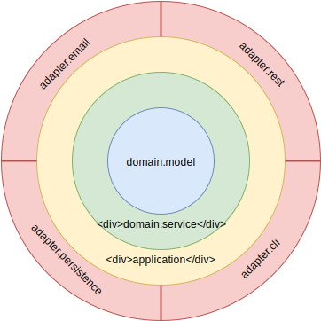

# Generic Architecture Tests with ArchUnit

This repository shows generic examples for architecture tests using [ArchUnit].
The tests are written in [Kotlin] using the [Junit5] testing framework.

## Onion Architecture

The term **onion architecture** was first used by Jeffrey Palermo in his [onion architecture blog post](https://jeffreypalermo.com/2008/07/the-onion-architecture-part-1/).
Other names for similar architectural approaches are
  [hexagonal architecture](http://alistair.cockburn.us/Hexagonal+architecture),
  [ports and adapters](http://wiki.c2.com/?PortsAndAdaptersArchitecture), and
  [clean architecture](http://blog.cleancoder.com/uncle-bob/2012/08/13/the-clean-architecture.html).

We built [ArchUnit] tests for this architectural style in the [OnionArchitectureTest.kt](./src/test/kotlin/com/github/spanierm/archunitjunit5kotlin/onion/OnionArchitectureTest.kt) file.
It assumes a certain structure of all classes in the root package, i.e. the package of the `OnionArchitectureTest` class:
* The core domain should be placed in the `domain` package.
  It contains the code logic of the application and is is independent of the infrastructure, adapters, frameworks in use, etc.
  We divide the package into two parts:
  * The `domain.model` package contains all models of the domain.
    Classes in this package do not have any dependencies to any other classes in the root package.
  * The `domain.service` package contains all logic of the domain.
    Classes in this package use the classes in `domain.model` package but do not have any dependencies to any other classes in the root package.
* All application related parts, i.e. technical logic needed for the application to run and that are not part of the core domain,
  should be placed in the `application` package.
  Examples are global settings for date and time, e.g. a global `Clock` object, or security related configuration that is not part of an individual adapter.
  Classes in this package can access the `domain` package but do not depend on any other classes in the root package.
* All external dependencies are placed in dedicated `adapter` packages.
  Examples are an `adapter.persistence` package that contains logic for storing and retrieving data from a data store
  or `adapter.cli` and `adapter.rest` packages for user interactions with the application.
  Classes in any `adapter` package can access all classes in the `domain` and `application` package
    but must not have dependencies on any other adapter packages.

    

Note that the example code in the [onion](./src/main/kotlin/com/github/spanierm/archunitjunit5kotlin/onion) package contain code that breaks the build.
Uncomment the corresponding parts to make the tests pass.

# Usage and Contribution

Let us know if you like [ArchUnit] and use the templates in this repository by leaving a tweet mentioning [@archtests] and [@spanier_m].

If you want to change parts of these examples, simply open a pull request with the changes and/or open an issue.

[@archtests]: https://twitter.com/archtests
[@spanier_m]: https://twitter.com/spanier_m
[ArchUnit]: https://www.archunit.org/
[Junit5]: https://junit.org/junit5/
[Kotlin]: https://kotlinlang.org/
